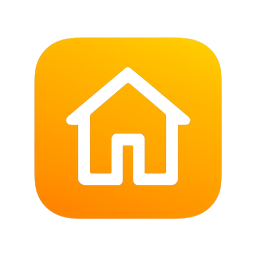
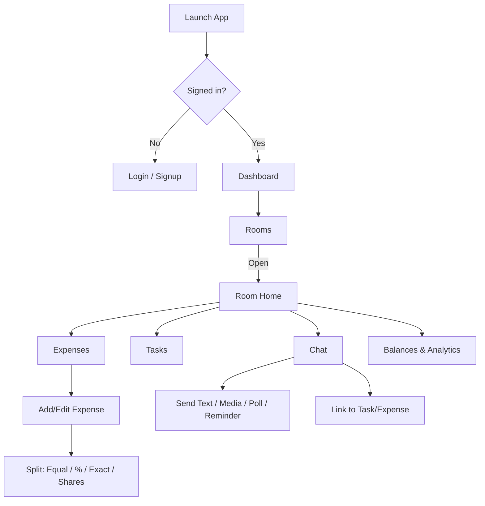

<div align="center">



# One Room — all‑in‑one roommate life manager 🏠✨

Keep your shared life simple: split expenses, track tasks, chat with roommates, and stay on top of reminders — all in a single app.

</div>

<p align="center">
	
</p>

<p align="center">
	<a href="#-features-at-a-glance"></a>
	<a href="#-getting-started"></a>
	<a href="#-security--privacy"></a>
	<a href="#-license"></a>
</p>

## Why I built this (a short story) 💬

Hi, I’m <b>mohd raza khan</b> — a B.Tech CSE student who shares a flat with friends. Like many students, we struggled with the little frictions of living together: “Who paid last time?”, “Why is the kitchen a mess?”, “When’s the rent due?”, “Drop the room Wi‑Fi password!”, and so on.

I looked around the Play Store and found plenty of apps solving one problem at a time, but none that felt like a calm, complete companion for the whole roommate experience. So I decided to build <b>One Room</b> — a single place where we can manage money, time, and conversations without chaos. This is for every student who wants less confusion and more harmony. 🤝

## ✨ Features at a glance

- 💸 Smart expenses — Equal, Percentage, Exact, and Shares splits with auto‑remainder logic and live validation
- 🧾 Clear “paid by” and “who owes what” summaries with real names (not just IDs)
- ✅ Tasks & categories — lightweight room chores and reminders
- 💬 Room chat — text, images, video, audio, polls, reminders, and quick links to tasks/expenses
- 🔗 Link picker — pick an expense or task from a list and drop it into chat (with copy‑ID helper)
- 🔒 Strong Firestore rules — messages and data are only visible to room members
- 🎨 Clean Material 3 design with readable AppBars and modern components

## 🧭 App flow (high‑level)



## 🎥 Screens & demo

Add your screenshots or screen recordings here (animated GIFs work great):

- docs/screens/dashboard.png
- docs/screens/room_home.png
- docs/screens/expense_add.gif
- docs/screens/chat_demo.gif
.

## 🛠️ Tech stack

- Flutter (Dart) — Material 3 UI, responsive components
- Firebase — Auth, Cloud Firestore, Cloud Storage
- Provider and best‑practice architecture for clean state and services

### Under the hood (how it all fits) 🔧

- Rooms → subcollections for `expenses`, `tasks`, `chats`, and immutable `auditLog`
- Expense splits: Equal / Percentage / Exact / Shares with auto‑remainder and guardrails
- Chat service: Firestore streams + Storage for media; message types: text, image, video, audio, poll, reminder, link
- Link picker: streams recent tasks/expenses to add rich references into chat
- Theming: Material 3 with AppBar foregrounds locked to onSurface for better contrast

## 🔐 Security & privacy

This is a public repository and is configured to avoid committing sensitive files.

- Firebase configs (google‑services.json, GoogleService‑Info.plist, firebase_options.dart) are <b>ignored</b>
- Platform keystores and local.properties are <b>ignored</b>
- Firestore rules restrict room content to <b>members only</b>

See `SECRETS.md` for local setup and CI guidance.

## 📱 User guide (quick tour)

1) Create or join a room
	- Invite roommates by sharing the room code or adding them directly.
2) Add expenses
	- Choose split type (Equal, %, Exact, Shares). The last person auto‑balances the remainder; % is clamped ≤ 100%.
3) See who paid and who owes
	- Clear summaries show real names and amounts.
4) Chat with your room
	- Send text, images, video, audio; create polls; drop payment reminders; link tasks/expenses.
5) Stay organized with tasks
	- Create categories and assign chores; link them in chat for quick context.
6) Review balances
	- See analytics and settle up confidently.

## 🚀 Getting started

Prerequisites:

- Flutter SDK set up (stable channel recommended)
- Firebase project created

Local setup:

1) Install the CLIs (once)

```bash
npm install -g firebase-tools
dart pub global activate flutterfire_cli
```

2) Configure Firebase for this app (creates `lib/firebase_options.dart` and platform files)

```bash
flutterfire configure
```

3) Run the app

```bash
flutter run
```

For more about secrets and public repos, read `SECRETS.md`.

## 🧩 Notable capabilities

- Percentage splits clamped to ≤ 100% and exact splits auto‑balance the remainder
- Save button is only enabled when splits are valid
- Polls in chat with single‑choice vote and live updates
- Error handling surfaces send failures via SnackBars (helpful for rules issues)
- Link dialog includes a quick “Pick from list” bottom sheet for tasks/expenses

## 🗺️ Roadmap

- Member picker for reminders (choose a roommate instead of typing a UID)
- Deep linking from chat to open an exact task/expense
- Richer media previews: video thumbnails, inline audio player

## 🤝 Contributing

Issues and PRs are welcome! If you’re a student living with roommates, I’d love your feedback on what would make this even more helpful.

## 🙏 A note from the author

Building One Room has been both personal and practical. It started with late‑night budgeting, chore lists on sticky notes, and endless “who paid?” debates. Turning those pains into features made me appreciate how much great software is really just a thoughtful conversation with real life. If this app saves you one awkward conversation or one missed payment — mission accomplished.

— <b>mohd raza khan</b>

## 📄 License

This project is released under the <b>PolyForm Noncommercial License 1.0.0</b>.

- Free to use, modify, and share for <b>non‑commercial</b> and <b>educational</b> purposes.
- <b>Commercial use</b> requires prior written permission from the author.

See the full text in `LICENSE`.

